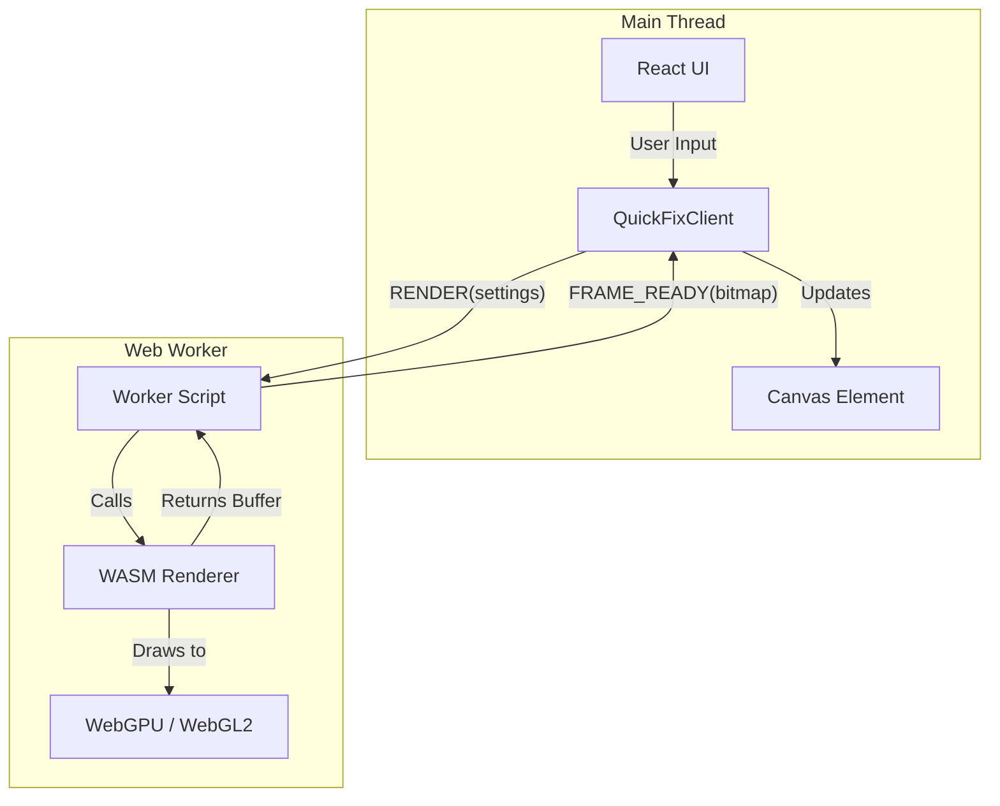
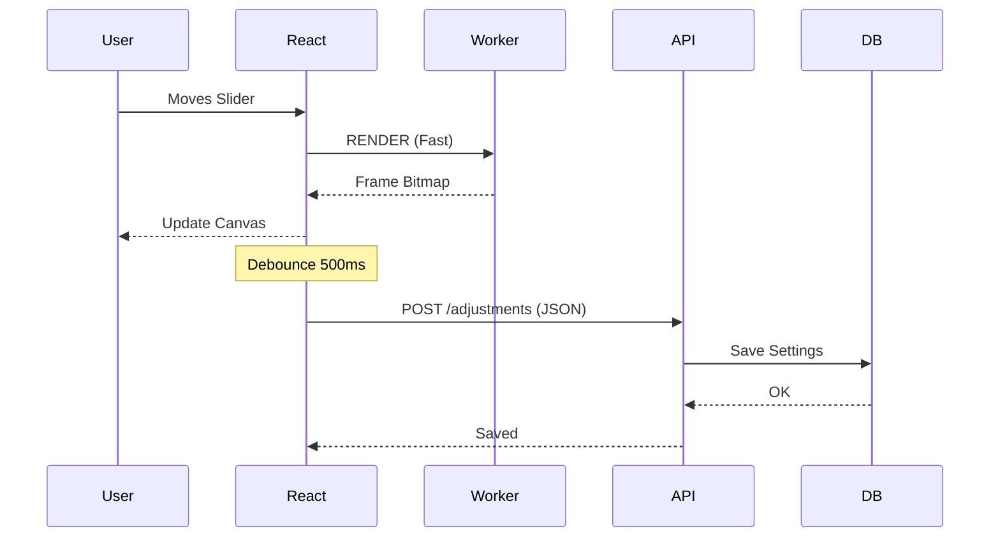

# Quick Fix Renderer Integration Guide

This guide details how to integrate the `quickfix-renderer` into a web application, covering the worker architecture, data flow, and persistence strategies.

## Architecture Overview

The renderer runs in a **Web Worker** to keep the main thread responsive. Communication happens via a message-passing protocol.



## Integration Steps

### 1. Initialize the Worker

Use the `QuickFixClient` wrapper to manage the worker.

```typescript
import { QuickFixClient } from 'quickfix-renderer/pkg/client';
import workerUrl from 'quickfix-renderer/pkg/worker.js?url'; // Vite syntax

// 1. Create Client
const client = new QuickFixClient(workerUrl);

// 2. Initialize WASM & Backend
await client.init({ backend: 'auto' });

// 3. Set Source Image (Stateful Mode)
// Transfers ownership of the buffer to the worker for efficiency
await client.setImage(imageBuffer, width, height);
```

### 2. Render Loop

Call `render()` whenever adjustments change. The client handles request correlation and cancellation.

```typescript
const settings = {
    exposure: { exposure: 0.5, contrast: 1.0 },
    color: { temperature: 0.0, tint: 0.0 },
    // ... other settings
};

try {
    const result = await client.render(
        null, // null = use stored image
        width,
        height,
        settings
    );
    
    // Draw result to canvas
    const ctx = canvasRef.current.getContext('2d');
    ctx.putImageData(new ImageData(result.data, width, height), 0, 0);
} catch (err) {
    console.error("Render failed:", err);
}
```

## Data Flow & Persistence

### Interactive Editing (Hot Path)

Users expect 60fps feedback. The "Hot Path" avoids main-thread blocking.

1. **User slides slider** -> React State Update.
2. **Effect Hook** triggers `client.render()`.
3. **Worker** processes frame (using cached source image).
4. **Canvas** updates with new frame.

### Persistence (Cold Path)

To save changes without spamming the backend:

1. **Debounce** the save operation (e.g., 500ms after last edit).
2. **Extract** current settings from React State.
3. **Send** settings JSON to the backend API.
4. **Backend** stores settings in the database.



## Debugging Integration

- **Check Network Tab**: Verify `worker.js` and `quickfix_renderer_bg.wasm` are loading correctly.
- **Console Logs**: The worker logs initialization status and errors.
- **Parity Testing**: If the WASM output looks different from the Python backend, use the `parity_test` suite in the renderer repo to compare outputs pixel-by-pixel.
