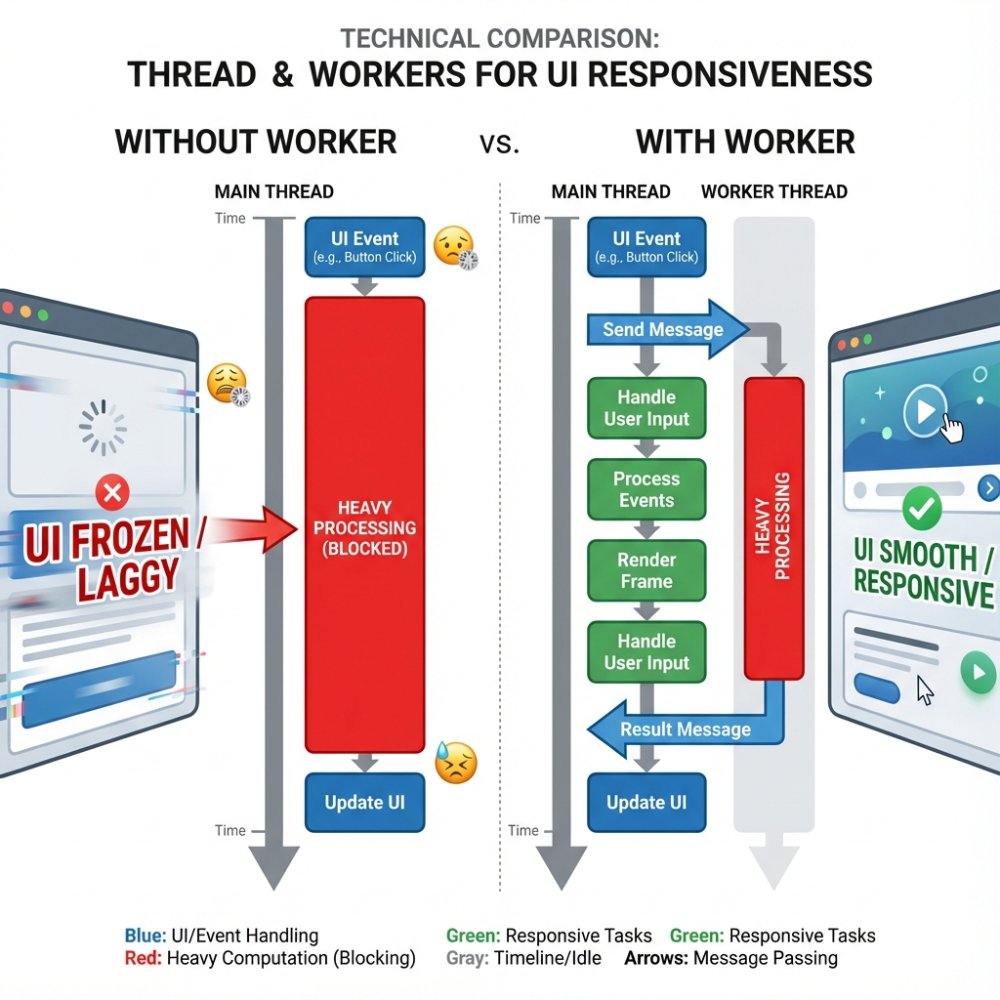
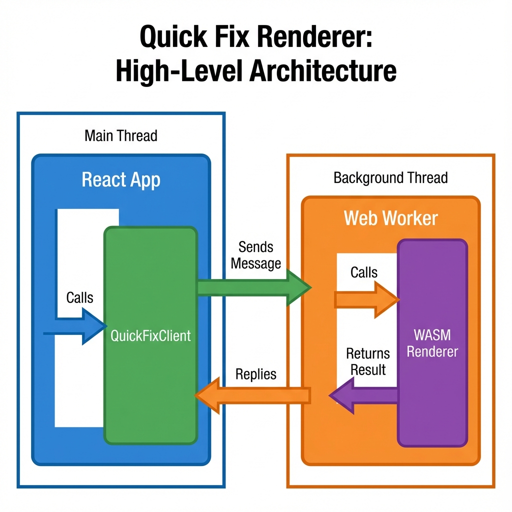
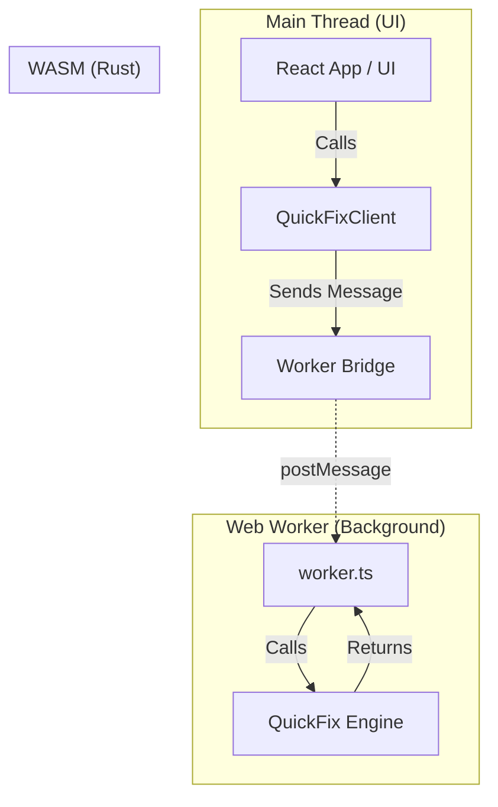

# Web Worker Architecture: A Deep Dive

This guide explains the architecture behind the **Quick Fix Renderer**'s Web Worker integration. It is designed for developers who want to understand *how* it works, *why* we built it this way, and the *benefits* it provides.

## 1. The Problem: The Main Thread Bottleneck

In a web browser, almost everything happens on a single thread called the **Main Thread**. This thread is responsible for:

* Running your JavaScript logic (React components, event listeners).
* Handling user interactions (clicks, scrolling, typing).
* **Painting the UI** (updating the screen).

### The Scenario

Imagine you have a slider to adjust the "Exposure" of a 4K image.

1. User moves the slider.
2. React detects the change.
3. We ask the WASM renderer to process the image.
4. **Problem:** If this processing takes 100ms, the Main Thread is *blocked* for 100ms.
5. **Result:** The slider freezes, the UI becomes unresponsive, and the animation stutters. This is "jank".

## 2. The Solution: Web Workers

**Web Workers** allow us to run JavaScript code in a **background thread**, separate from the Main Thread.

By moving the heavy image processing to a Worker:

1. User moves the slider.
2. Main Thread sends a message to the Worker: "Please render this with exposure +1.0".
3. **Main Thread is immediately free** to update the slider UI and handle other events.
4. Worker crunches the numbers in the background (100ms).
5. Worker sends the result back: "Here is the new image".
6. Main Thread displays the result.

**Result:** Butter-smooth UI, even if the rendering is heavy.

## 3. Architecture Overview

Our architecture consists of three main layers:

## 4. Component Breakdown

### 1. `QuickFixClient` (The Manager)

* **Location:** `quickfix-renderer/ts/client.ts`
* **Role:** This is the user-facing API. It lives on the Main Thread.
* **Responsibility:**
  * Hides the complexity of `postMessage`.
  * Provides nice `async/await` methods like `init()` and `render()`.
  * Matches requests to responses using unique IDs (`requestId`).
  * **Why?** So you don't have to write raw message handlers in your React components.

### 2. `protocol.ts` (The Language)

* **Location:** `quickfix-renderer/ts/protocol.ts`
* **Role:** Defines the "contract" between the Main Thread and the Worker.
* **Responsibility:**
  * Defines TypeScript interfaces for every message (`INIT`, `RENDER`, `CANCEL`).
  * Ensures type safety: The Worker knows exactly what data to expect.
  * **Why?** To prevent bugs where the Main Thread sends data the Worker doesn't understand.

### 3. `worker.ts` (The Worker)

* **Location:** `quickfix-renderer/ts/worker.ts`
* **Role:** The entry point for the background thread.
* **Responsibility:**
  * Initializes the WASM module.
  * Listens for messages from the Client.
  * Calls the actual Rust/WASM functions.
  * Manages memory (creating/freeing WASM objects).
  * **Why?** To isolate the heavy lifting from the UI.

### 4. `WASM Renderer` (The Engine)

* **Location:** `quickfix-renderer/src/lib.rs` (Rust)
* **Role:** The high-performance image processing engine.
* **Responsibility:**
  * Executes the math (Exposure, Color, Grain) on the CPU or GPU.
  * **Why?** Rust/WASM is significantly faster than raw JavaScript for pixel manipulation.

## 5. Key Concepts & Optimizations

### Asynchronous Communication

Communication with a Worker is **asynchronous**. You send a message and wait for a reply.

* **Implementation:** `QuickFixClient.render()` returns a `Promise`.
* **Flow:**
    1. `client.render()` creates a `requestId` (e.g., 123).
    2. Stores `resolve` function in a Map: `pendingRequests.set(123, resolve)`.
    3. Sends message to Worker.
    4. ...Time passes...
    5. Worker replies: "Result for request 123".
    6. Client looks up request 123 in the Map and calls `resolve(result)`.

### Transferables (Zero-Copy)

Sending large images (e.g., 4K buffers) between threads can be slow if the browser has to **copy** the data.

* **Optimization:** We use **Transferable Objects** (`ArrayBuffer`, `ImageBitmap`).
* **How it works:** Instead of copying the memory, ownership is *transferred*. The Main Thread loses access to the buffer, and the Worker gains it instantly.
* **Benefit:** Sending a 50MB image takes almost 0ms instead of 50-100ms.

### Cancellation (Debouncing)

When a user scrubs a slider, they might generate 60 events per second. We don't want to render all 60 intermediate frames if the Worker is slow.

* **Strategy:** The Worker tracks the `latestRequestId`.
* **Logic:** If the Worker finishes request #5, but sees that request #10 has already arrived, it discards the result of #5.
* **Benefit:** The UI always shows the *freshest* possible state without getting bogged down by old work.

## 6. Summary of Benefits

| Feature | Benefit |
| :--- | :--- |
| **Off-Main-Thread** | UI never freezes, animations stay smooth (60fps). |
| **Type Safety** | `protocol.ts` ensures Client and Worker always agree on data formats. |
| **Zero-Copy** | Transferables make passing large images instant. |
| **Encapsulation** | `QuickFixClient` makes using the Worker as easy as calling a function. |
